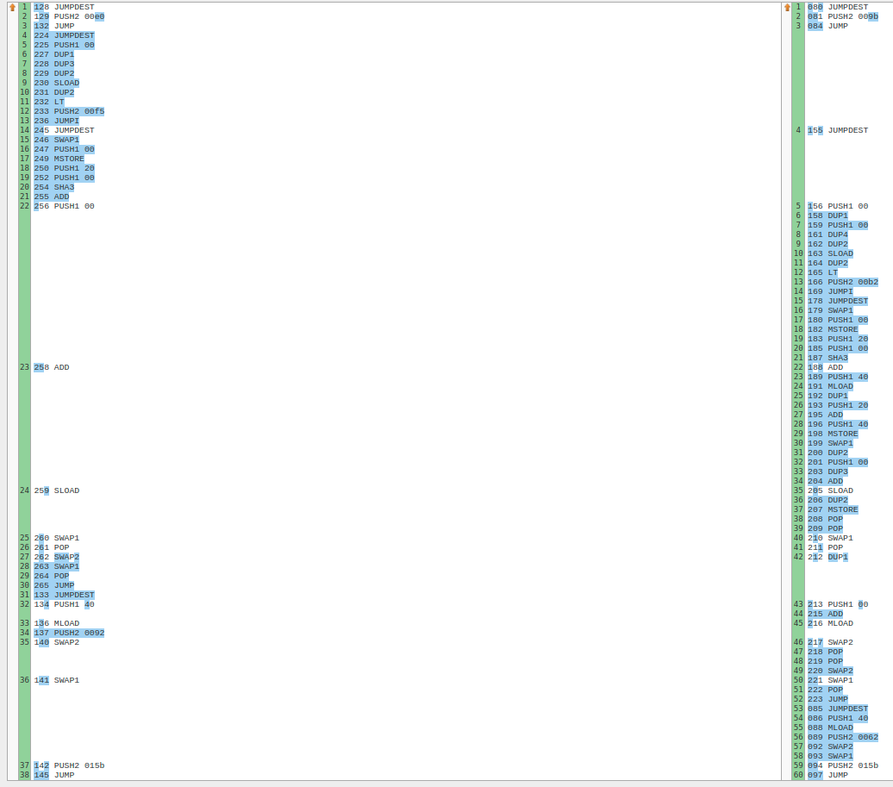

# Solidity Mid Test

## .env Configuraion

Before you get to testing you have to create at the root of the project file called `.env`.

Then you must fill it:

```
ALCHEMY_KOVAN="<ALCHEMY KOVAN PROJECT API KEY>"
ALCHEMY_GOERLI="<ALCHEMY GOERLI PROJECT API KEY>"
ALCHEMY_RINKEBY="<ALCHEMY RINKEBY PROJECT API KEY>"
ALCHEMY_MAINNET="<ALCHEMY MAINNET PROJECT API KEY>"
MNEMONIC="<YOUR 12 WORLD MNEMONIC OF HD WALLET>"
ETHERSCAN_API_KEY="<YOUR ETHERSCAN API KEY>"
REPORT_GAS="true"
```

You can find an example of the `.env` file in the root of the project.

## First task

Firstly read docs, found about consensus contract (cause Fuse is DPoS). Then found proxy of the contact. Did research of the ABI of implementation begind the proxy. By the way, Eternal Storage as upgradability pattern sucks. Did the setup of the project based on my personal template. Then built the contract at `contracts/first/First.sol` and an interface `contracts/first/ICoreConsensus.sol` which declares two methods that I need to: check if an address is validator and to obtain some validator address to impersonate. Then I wrote a test which tries to call secured method `testModifier` as non-validator and as validator signer.

You can test the first task by executing `npx hardhat test`. It will fork the Fuse mainnet and execute the test.

## Second task

The `checkBlockHeader` function of the `Second` contract is acquiring the block hash of the specific block number and accepts custom made struct of the Ethereum Mainnet block header. The specific content of the block header is described at the Yellow Paper in part 4.3.

Then I found an `RLPEncode` contract which can RLP encode onchain, and it is made by some nice guy from the internet. His github reference is in NatSpec of the contract. I just made some wrapper function so the struct could fit in his RLP encoder methods. I also remembered that in block header of London hardfork there is an additional field called `baseFeePerGas`. It is required to burn some fees to maintain some economical issues of the Ether.

You can test the second task by executing `npx hardhat test`. It will fork the Ethereum mainnet and execute the test.

## Third task

1. `Is there a difference in gas efficiency between the two ways to return the person age?` - Yes, because the A variant is allocating a reference type variable in memory and additionally performing assignment operation. But the B variant is just storing the result of storage read in stack and then just passing it to the end return mechanism of the contract.

2. `if so why?` - Here is an OPCODE analysis of both variants:



This is part of the functions executions where the business logic is. To the left is the execution of B variant and to the opposite side is A variant. You can see, that in the variant A there is much more MLOADs and MSTOREs OPCODE which read and allocate the memory for the `p` variable. The main difference is at the center of both variants. You can see that in the A variant is an allocation block for the variable, instead of just adding the reference to storage at mark `259 SLOAD` in the variant B.

You can also check that the A variant is more expensive by executing `npx hardhat test`. It will fork the Fuse mainnet (just for fun and for not performing an unnecessary work on network management) and execute the test.

## Fourth task

I made some calculations. Firstly, let's consider the constant product of reserves formula `x * y = k`. The swap in this case is `(x + a) * (y - b) = k`.
The `a` and `b` are the input and the output of the swap. Consider the price impact `I` in percents [0, 100]. The current price is `p = x / y`. The price after possible impact is `p * I / 100`. Here are some explanation page down below.

Firstly, I am defining the variables and build the formula for `a` in terms of the price after impact and the output of swap. Then goes an equation from which I will extract maximum possible `b` after price impact.


You can test the first task by executing `npx hardhat test`. It will fork the Ethereum mainnet and execute the test.
